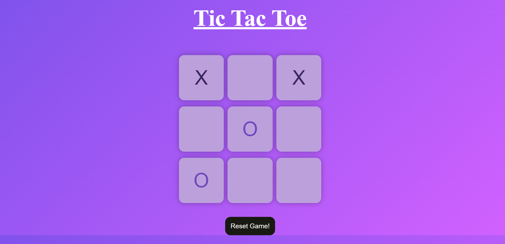
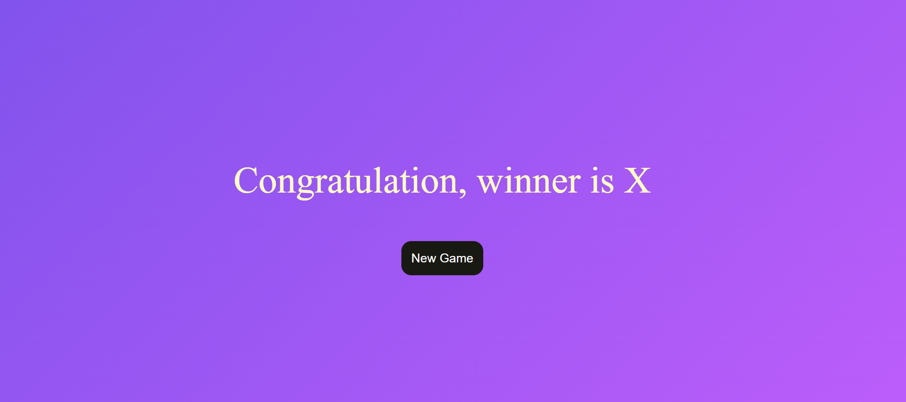

# TicTacToe Game

A simple browser-based **TicTacToe** game implemented using HTML, CSS, JavaScript, and Django as the backend. The game allows two players to take turns marking spaces in a 3x3 grid. The game ends when one player wins by aligning three of their marks vertically, horizontally, or diagonally, or when all spaces are filled and the game is a draw.

With the addition of a Django backend, the game now supports multiplayer functionality across different devices and saves the game state, allowing players to resume the game even if they leave the page.

## Features

- **Two-player functionality**: Play as Player X or Player O.
- **Real-time winner detection**: Detects a winner based on common winning patterns (rows, columns, and diagonals).
- **Draw detection**: Declares a draw if all spaces are filled without a winner.
- **Reset functionality**: Reset the game board to play again.
- **New Game button**: Easily start a fresh new game.
- **Django Backend**:
  - Game state persistence: Game progress is saved in the backend.
  - Multiplayer across devices: Players can play against each other from different devices.
  - Game history: Save and retrieve game history.

## Demo

  
  
_A screenshot of the game interface._

## How to Play

1. Player X starts the game by clicking on any box in the 3x3 grid.
2. Player O then takes their turn by selecting an empty box.
3. The game alternates between Player X and Player O until:
   - One player wins by getting three of their marks in a row, column, or diagonal.
   - All boxes are filled, resulting in a draw.
4. Once the game is over, click the "New Game" or "Reset Game" button to play again.
5. Players can also log in from different devices, with the game state saved and synced using the Django backend.

## Project Structure

```plaintext
TicTacToe/
│
├── backend/                  # Django backend directory
│   ├── manage.py             # Django project management file
│   ├── tictactoe/            # Main Django application directory
│   │   ├── models.py         # Game data models
│   │   ├── views.py          # Backend logic for handling requests
│   │   ├── urls.py           # URL routing for the app
│   │   └── templates/        # HTML templates served by Django
│   └── db.sqlite3            # SQLite database for development
│
├── frontend/                 # Frontend files for the game
│   ├── index.html            # Main HTML file for the game
│   ├── style.css             # CSS file for styling the game
│   └── javascript.js         # JavaScript file for the game logic
├── assets/                   # Folder for images, screenshots, etc.
│   └── tictactoe_screenshot.png
└── README.md                 # Project documentation
